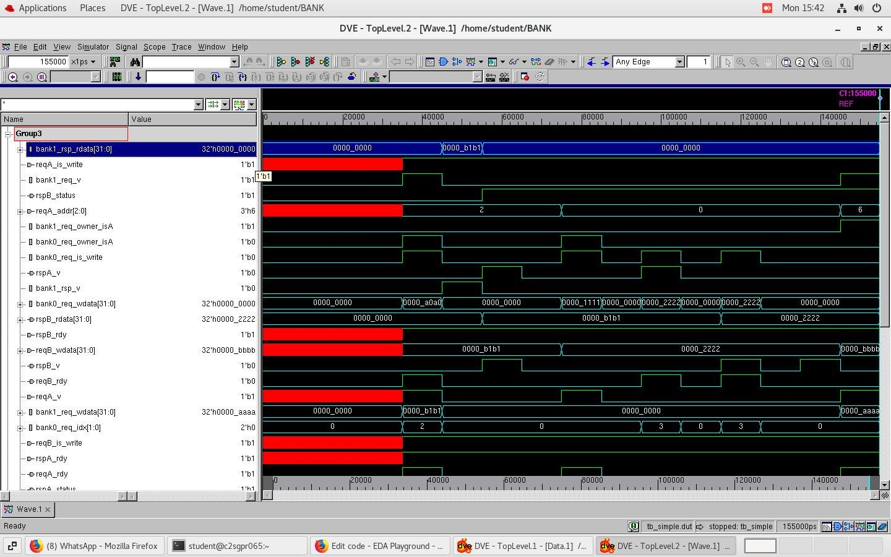

# Banked Cache Line Selector

## 📌 Description
This project implements a banked cache line selector using RTL design with a round-robin scheduler to efficiently handle dual-port memory access.

## ⚙️ Features
- Dual-port memory access (Port A & Port B)
- Banked memory architecture (2 banks)
- Round-robin arbitration for conflict resolution
- Conflict handling mechanism

## 🧠 Architecture

## 🧪 Verification
- SystemVerilog testbench developed
- Tested scenarios:
  - Parallel access
  - Conflict case
  - Read/write operations

## 📊 Waveform Output

## 🧠 Design Explanation

The design uses a banked memory architecture with two banks to support parallel access from two ports.

A round-robin scheduler is implemented to handle conflicts when both ports access the same memory bank. The scheduler ensures fair access by alternating priority between requests.

The system supports:
- Parallel access to different banks
- Conflict resolution using arbitration
- Owner-based response routing

## 📁 Project Structure
- rtl/ → Design files  
- tb/ → Testbench  
- docs/ → Block diagram  
- results/ → Simulation output  

## 👨‍💻 Contributors
- Pavan  
